# HISinOne TYPO3 Connector Frontend Theme

## Frontend der HIO-Publisher Demoseite

Diese TYPO3-Extension stellt das Frontend-Theme für die HIO-Publisher Demoseite bereit.
Sie ergänzt `wtl/hio-typo3-connector` um Fluid-Templates, Partials, DataProcessor,
Container-Elemente und ein optionales CSS/JavaScript-Bundle.

Das Theme ist als Beispielimplementierung gedacht. Es kann direkt genutzt oder als
Ausgangspunkt für ein projektspezifisches Design angepasst werden.

➡️ **[Changelog](CHANGELOG.md)** – Alle Änderungen, neue Features und Breaking Changes

## Frontend-Elemente

Die Extension rendert die Listen- und Detailansichten der HIO-Publisher-Plugins aus
`wtl/hio-typo3-connector`.

| Element | Funktion |
| --- | --- |
| Publikationsliste | Liste importierter Publikationen mit Filter, Detail-Links und Pagination |
| Publikationsdetail | Detailansicht einer Publikation mit Autorinnen und Autoren, Journal-, Konferenz- und Identifier-Daten |
| Projektliste | Liste importierter Projekte mit Filter, Detail-Links und Pagination |
| Projektdetail | Detailansicht eines Projekts mit Projektbeteiligten und Projektdaten |
| Personenliste | Liste importierter Personen mit Filter, Detail-Links und Pagination |
| Personendetail | Detailansicht einer Person mit Kontaktdaten und verknüpften Forschungsdaten |
| Organisationseinheitenliste | Liste importierter Organisationseinheiten mit Detail-Links und Pagination |
| Organisationseinheit-Detail | Detailansicht einer Organisationseinheit mit Adresse und verknüpften Forschungsdaten |
| Patentliste und Patentdetail | Listen- und Detaildarstellung importierter Patente |
| Promotionsliste und Promotionsdetail | Listen- und Detaildarstellung importierter Promotionen |
| Habilitationsliste und Habilitationsdetail | Listen- und Detaildarstellung importierter Habilitationen |
| Nominierungsliste und Nominierungsdetail | Listen- und Detaildarstellung importierter Nominierungen und Preisanerkennungen |
| Forschungsinfrastrukturliste und Detail | Listen- und Detaildarstellung importierter Forschungsinfrastrukturen |
| Ausgründungsliste und Detail | Listen- und Detaildarstellung importierter Ausgründungen |

Zusätzlich stellt die Extension redaktionelle Container-Elemente bereit:

| Element | Funktion |
| --- | --- |
| `Featured projects` / `Ausgewählte Projekte` | Container für bis zu 12 hervorgehobene Projekte |
| `Featured project` / `Ausgewähltes Projekt` | Kindelement mit Bild und genau einem ausgewählten Projekt |
| `Featured publications` / `Ausgewählte Publikationen` | Container für bis zu 12 hervorgehobene Publikationen |
| `Featured publication` / `Ausgewählte Publikation` | Kindelement mit Bild und genau einer ausgewählten Publikation |

## Beispiel: Publikationsliste mit Detailansicht

Dieses Beispiel zeigt den typischen Aufbau einer Listen- und Detailseite.

### Backend-Konfiguration

1. Legen Sie eine Seite `Publikationen` an.
2. Fügen Sie auf dieser Seite das Plugin `HISinOne Publikationen` ein.
3. Wählen Sie im Plugin optional eine Zitierweise, Sortierung und Trefferzahl pro Seite.
4. Legen Sie eine Seite `Publikationsdetail` an.
5. Tragen Sie die Seite `Publikationsdetail` in den TypoScript-Konstanten als
   `publicationTargetPageUid` ein, wo aus anderen Ansichten auf Publikationen verlinkt
   werden soll.
6. Prüfen Sie im Frontend, ob die Publikationsliste angezeigt wird und Detail-Links auf die
   Detailseite führen.

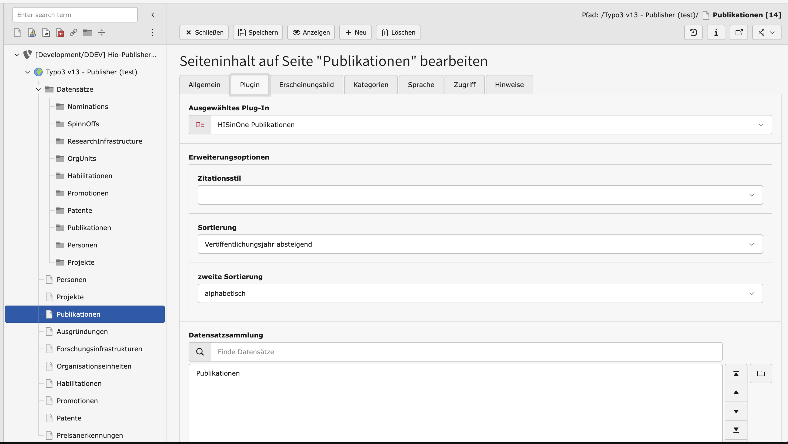

### Frontend-Ergebnis

Die Publikationsliste zeigt die importierten Publikationen als Liste mit Filter- und
Pagination-Bereich. Ein Klick auf einen Eintrag öffnet die Detailansicht.

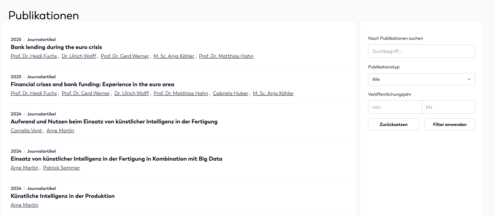

Die Detailansicht zeigt die Daten der ausgewählten Publikation.

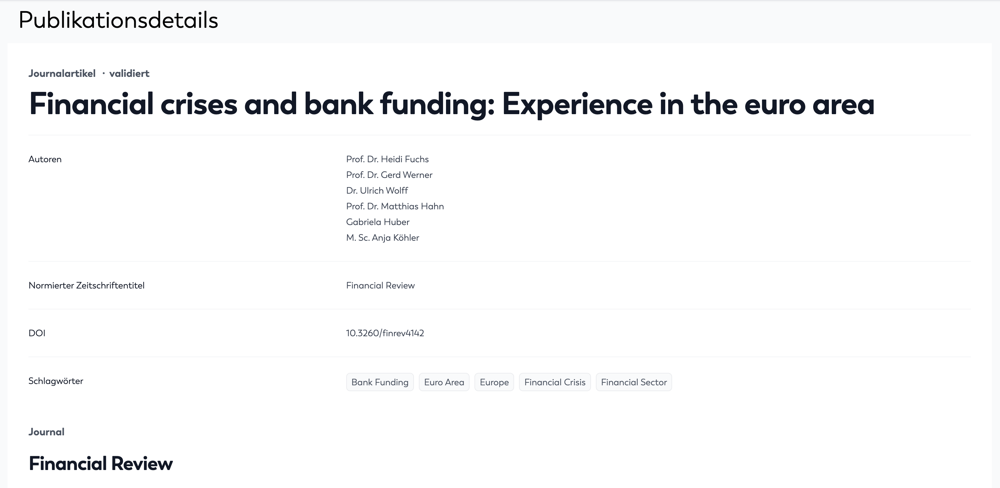

## Use Case: Redaktionelle Contentseite erstellen

Eine redaktionelle Contentseite kombiniert normale TYPO3-Inhalte mit HIO-Publisher-Daten.
Typisch ist zum Beispiel eine Themenseite, die einen Einleitungstext, ausgewählte Projekte
und ausgewählte Publikationen enthält.

### Schritt-für-Schritt

1. Legen Sie im Seitenbaum eine neue Seite an, zum Beispiel `Forschungsschwerpunkt`.
2. Fügen Sie ein normales Textelement oder ein projektspezifisches Content-Element als
   Einstieg hinzu.
3. Fügen Sie den Container `Ausgewählte Projekte` hinzu.
4. Legen Sie im Container ein oder mehrere Kindelemente `Ausgewähltes Projekt` an.
5. Wählen Sie pro Kindelement ein Bild und genau ein importiertes Projekt aus.
6. Fügen Sie bei Bedarf den Container `Ausgewählte Publikationen` hinzu.
7. Legen Sie im Container ein oder mehrere Kindelemente `Ausgewählte Publikation` an.
8. Wählen Sie pro Kindelement ein Bild und genau eine importierte Publikation aus.
9. Speichern Sie die Seite und prüfen Sie die Darstellung im Frontend.

## Featured projects

`Featured projects` ist ein Container-Element. Es fasst mehrere Kindelemente vom Typ
`Featured project` zusammen. Pro Container können bis zu 12 Projekte gepflegt werden.

### Konfiguration

1. Fügen Sie das Content-Element `Ausgewählte Projekte` ein.
2. Öffnen Sie den Container im Page-Modul.
3. Fügen Sie als Kindelement `Ausgewähltes Projekt` hinzu.
4. Wählen Sie ein Bild aus.
5. Wählen Sie im Feld `Ausgewähltes Projekt` genau ein importiertes Projekt aus.
6. Wiederholen Sie die Schritte für weitere Projekte.

Die Detail-Links verwenden `plugin.tx_hiotypo3connector.settings.featuredProjects.projectTargetPageUid`.

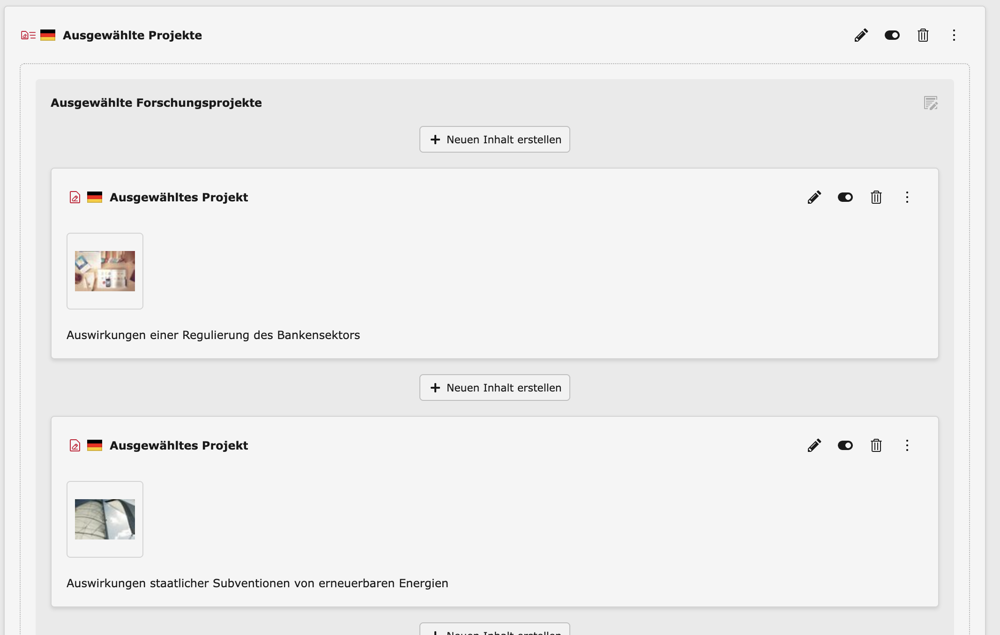

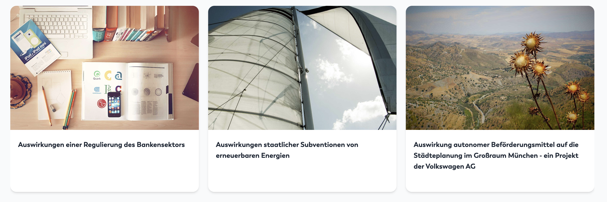

## Featured publications

`Featured publications` ist ein Container-Element. Es fasst mehrere Kindelemente vom Typ
`Featured publication` zusammen. Pro Container können bis zu 12 Publikationen gepflegt
werden.

### Konfiguration

1. Fügen Sie das Content-Element `Ausgewählte Publikationen` ein.
2. Öffnen Sie den Container im Page-Modul.
3. Fügen Sie als Kindelement `Ausgewählte Publikation` hinzu.
4. Wählen Sie ein Bild aus.
5. Wählen Sie im Feld `Ausgewählte Publikation` genau eine importierte Publikation aus.
6. Wiederholen Sie die Schritte für weitere Publikationen.

Die Detail-Links verwenden
`plugin.tx_hiotypo3connector.settings.featuredPublications.publicationTargetPageUid`.

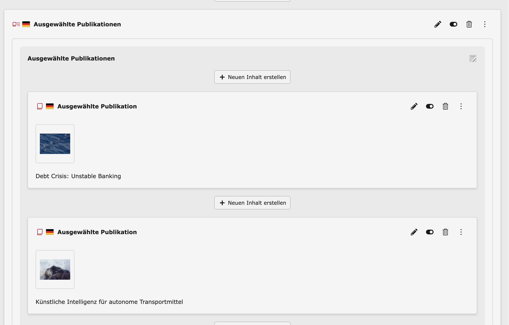

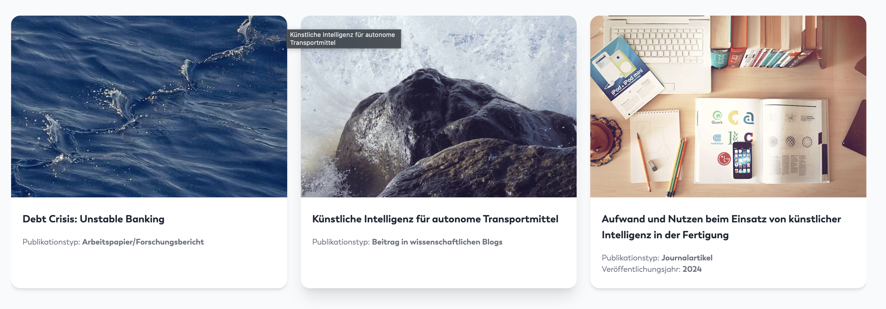

## Frontendplugins für Personen und Organisationseinheiten

Die folgenden Plugins zeigen Forschungsdaten zu genau einer ausgewählten Person oder
Organisationseinheit. Sie eignen sich für Profilseiten, Detailseiten und redaktionelle
Landingpages.

### Publikationen zur Person

Plugin: `HISinOne Publikationen der Person`

1. Fügen Sie das Plugin auf der gewünschten Seite ein.
2. Wählen Sie im Plugin-Feld `Person` genau eine Person aus.
3. Wählen Sie optional eine Zitierweise.
4. Wählen Sie optional eine Gruppierung, zum Beispiel nach Jahr oder Typ.
5. Wählen Sie optional eine Sortierung.
6. Aktivieren Sie bei Bedarf Statistikbereiche wie Publikationstypen oder Koautorenschaften.
7. Speichern Sie das Inhaltselement und prüfen Sie das Frontend.

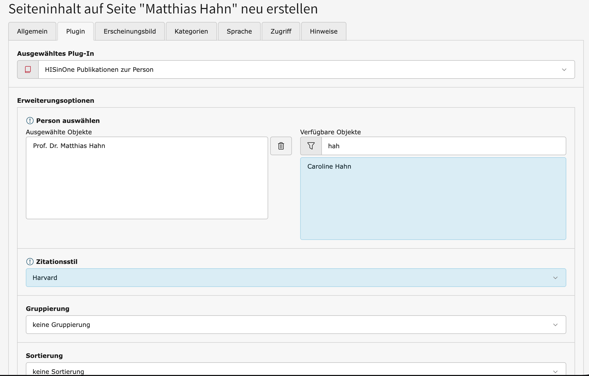

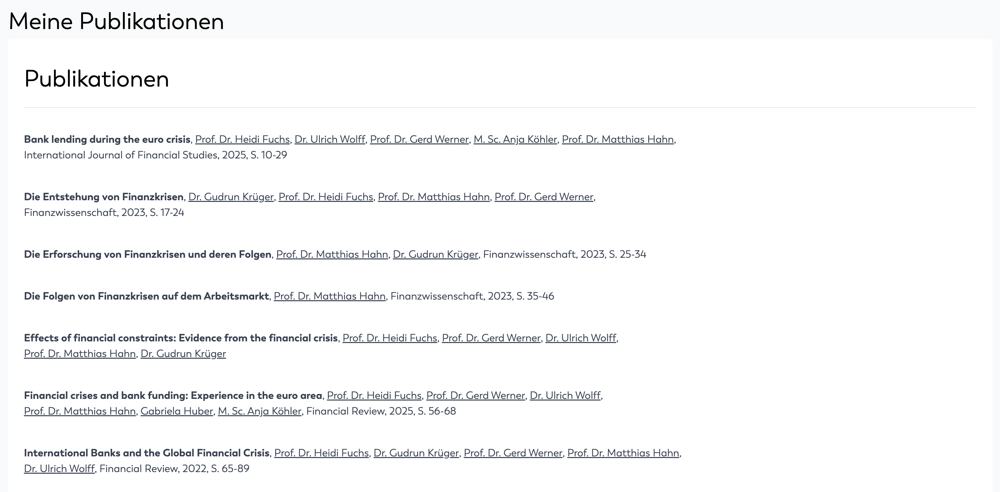

### Projekte zur Person

Plugin: `HISinOne Projekte der Person`

1. Fügen Sie das Plugin auf der gewünschten Seite ein.
2. Wählen Sie im Plugin-Feld `Person` genau eine Person aus.
3. Aktivieren Sie bei Bedarf die Projektstatus-Statistik.
4. Speichern Sie das Inhaltselement und prüfen Sie das Frontend.

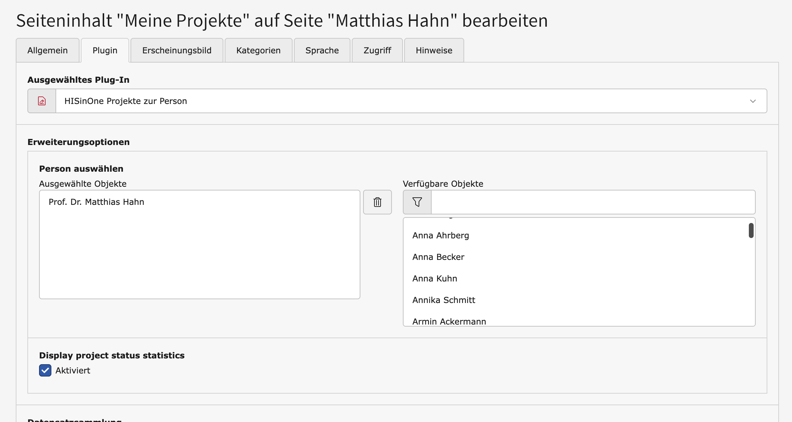

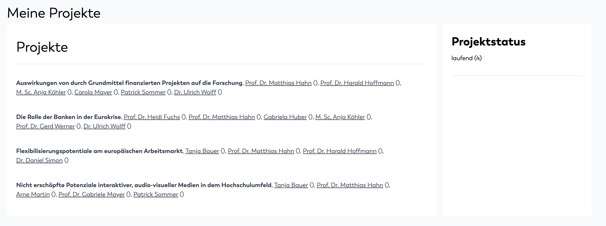

### Gleicher Ablauf für weitere Bezugslisten

Die Plugins für Organisationseinheiten folgen demselben Muster wie die beiden Beispiele zur
Person: Inhaltselement einfügen, Bezugsdatensatz auswählen, optionale Darstellungseinstellungen
setzen und Frontend prüfen.

| Plugin | Besonderheit |
| --- | --- |
| `HISinOne Publikationen der Organisationseinheit` | wie `Publikationen der Person`, aber mit Auswahl einer Organisationseinheit |
| `HISinOne Projekte der Organisationseinheit` | wie `Projekte der Person`, aber mit Auswahl einer Organisationseinheit |
| `HISinOne Personen der Organisationseinheit` | Auswahl einer Organisationseinheit, Ausgabe der verknüpften Personen |
| `HISinOne Patente der Organisationseinheit` | Auswahl einer Organisationseinheit, Ausgabe der verknüpften Patente |

Die weiteren Personen-Plugins funktionieren ebenfalls analog: Bezugs-Person auswählen und
die verknüpften Daten ausgeben. Dazu gehören Organisationseinheiten, Patente, Promotionen
und Habilitationen der Person.

## Frontend-Assets bauen

Vor jeder Veroeffentlichung muessen die Frontend-Assets neu gebaut und die erzeugten Dateien
mit veroeffentlicht werden.

Die Build-Skripte fuer CSS und JavaScript liegen unter `Resources/Private/Frontend`.

```bash
cd Resources/Private/Frontend
npm ci
npm run build
```

Der Build erzeugt die Dateien unter `Resources/Public/Css/hio_typo3_connector.css` und
`Resources/Public/Js/hio-connector-wtl.js`.

Bei Bedarf koennen CSS und JavaScript auch einzeln gebaut werden:

```bash
npm run build-css
npm run build-js
```

## Hinweise zu Container-Elementen

Die Content-Elemente `featuredProjects` / `featuredProject` sowie `featuredPublications` /
`featuredPublication` sind als Container- bzw. Child-Elemente auf Basis von `b13/container`
umgesetzt.

Die fachliche Einschränkung der erlaubten Child-Elemente wird in der
Container-Konfiguration definiert. Damit diese Einschränkung auch im Backend-Formular
konsequent für die `CType`-Auswahl berücksichtigt wird, wird die optionale Extension
`ichhabrecht/content-defender` empfohlen.

Ohne `content-defender` funktionieren die Container weiterhin, die Einschränkung der
auswählbaren Child-Elemente im Bearbeitungsformular ist dann jedoch unter Umständen nicht
vollständig.
